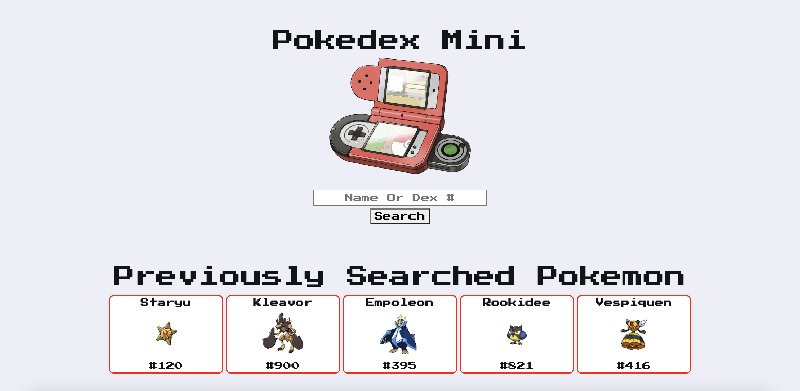
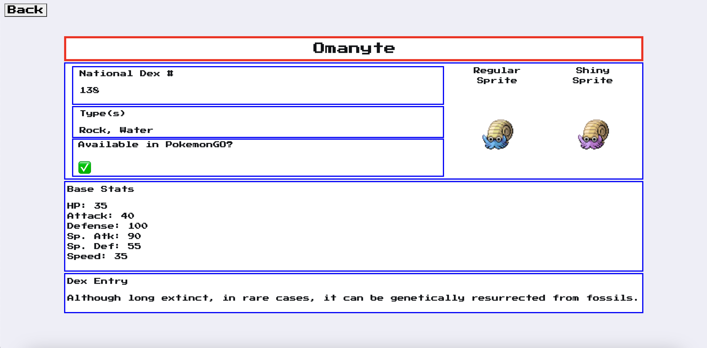

# Pokedex Mini

## Description
The Pokedex Mini application allows users to search for any Pokemon from generation 1-8 using the Pokemon's name or national dex number. When the user searches they will be redirected to the results page containing the Pokemon's:
- Name
- Regular sprite
- Shiny sprite
- National dex number
- Type
- Base stats
- Pokedex entry
- An indicator telling them if that Pokemon is available in Pokemon Go.

When the user returns to the home page they will be presented with five boxes containing up to their past 5 searches.

## Deployed Application
The deployed webpage can be found here: https://retrotechcode.github.io/Pokedex-Mini/

